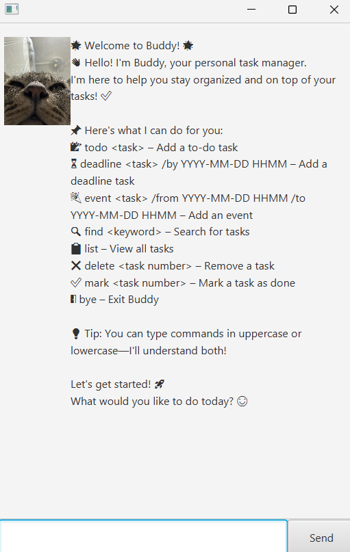
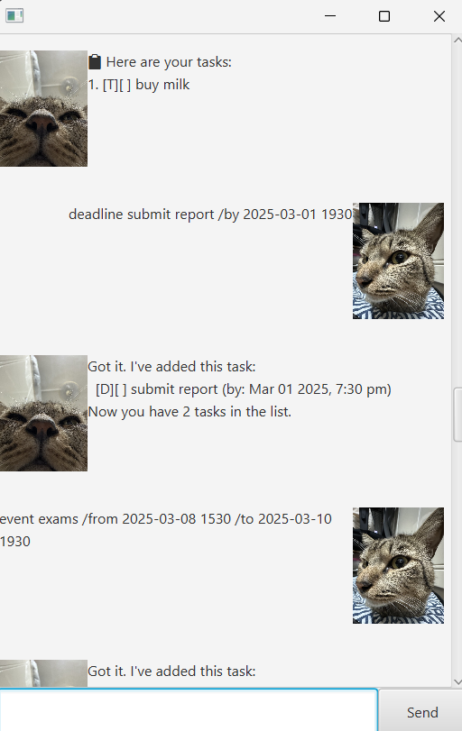

# Buddy Task Manager - User Guide

---




## Introduction
Buddy is your personal task manager 📋, designed to help you stay organized and productive. With Buddy, you can easily add tasks, set deadlines, and manage your to-do list efficiently. 🚀

## Features:
- Add and manage different types of tasks (To-Do, Deadline, Event)
- Search for tasks by keywords 🔍 
- Mark tasks as done ✅ or remove them ❌ 
- View your full task list 📋

## Adding Todos

Use the `todo` command to add a basic task without any specific date or time. Buddy will remember your todo and update you with the total number of tasks in your list.

**Usage**:
```
todo <description>
```

**Example**:
```
todo buy milk
```

**Expected Outcome**:
```
Got it. I've added this task:
 [T][ ] read book
Now you have 1 tasks in the list.
```

---

## Adding deadlines

Use the `deadline` command to add a task that must be done before a specific date and time. Buddy will remember your new deadline and update you with the total number of tasks in your list.

**Usage**:
```
deadline <description> /by <YYYY-MM-DD HHMM>
```

**Example**:
```
deadline submit report /by 2025-03-01 1930
```

**Expected Outcome**:
```
Got it. I've added this task:
 [D][ ] submit report (by: Mar 01 2025, 7:30 pm)
Now you have 2 tasks in the list.
```

---

## Adding Events

Use the `event` command to add a task with a starting and ending time and date. Buddy remember these and update you with the total number of tasks in your list.

**Usage**:
```
event <description> /from <YYYY-MM-DD HHMM> /to <YYYY-MM-DD HHMM>
```

**Example**:
```
event exams /from 2025-03-08 1530 /to 2025-03-10 1930
```

**Expected Outcome**:
```
Got it. I've added this task:
 [E][ ] project meeting (from: Mar 08 2025, 3:30 pm to: Mar 10 2025, 7:30 pm)
Now you have 4 tasks in the list.
```

---

## Listing Tasks

Use the `list` command to view all tasks currently stored.

**Usage**:
```
list
```

**Expected Outcome**:
```
📋 Here are your tasks:
  1. [T][ ] buy milk
  2. [D][ ] submit report (by: Mar 01 2025, 7:30 pm)
  3. [E][ ] exams (from: Mar 08 2025, 3:30 pm to: Mar 10 2025, 7:30 pm)
```

---

## Marking a Task

When a task is done, you can mark it with an `X` to indicate completion.

**Usage**:
```
mark <task_number>
```

**Example**:
```
mark 1
```

**Expected Outcome**:
```
Nice! I've marked this task as done:
 [T][X] buy milk
```

---


## Unmarking a Task

If you marked a task by mistake or want to revert it to undone status:

**Usage**:
```
unmark <task_number>
```

**Example**:
```
unmark 1
```

**Expected Outcome**:
```
OK, I've marked this task as not done yet:
 [T][ ] buy milk
```

---

## Deleting Tasks

Use the `delete` command to remove a specific task from your list.

**Usage**:
```
delete <task_number>
```

**Example**:
```
delete 2
```

**Expected Outcome**:
```
Noted. I've removed this task:
 [D][ ] submit report (by: Mar 01 2025, 7:30 pm)
Now you have 2 tasks in the list.
```

---

## Finding Tasks

If you want to locate tasks by a keyword in their description:

**Usage**:
```
find <keyword>
```

**Example**:
```
find exams
```

**Expected Outcome**:
```
Found tasks:
1.[E][ ] exams (from: Mar 08 2025, 3:30 pm to: Mar 10 2025, 7:30 pm)
```

---

## 💡Tips

You can type commands in uppercase or lowercase—Buddy understands both!

When using the find command, Buddy will try to understand your typos!

Use list frequently to keep track of your tasks.

Be precise with dates and times for deadlines and events.

---

Have fun with Buddy!